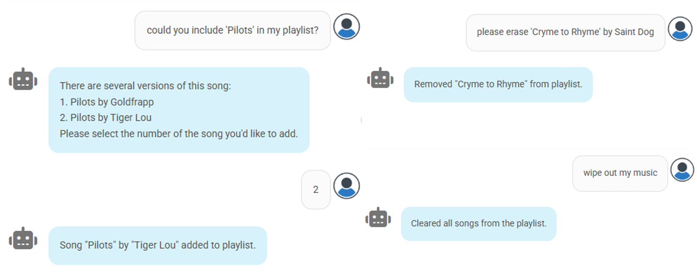

# 🎵 Music Assistant based on LLMs & NLP

> **Bachelor's Thesis (TFG) - Computer Engineering Degree**
> 
> *Escuela Técnica Superior de Ingeniería (ETSI), Universidad de Huelva*
>
> **Author:** Antón Maestre Gómez | **Supervisor:** Jacinto Mata Vázquez

[](https://www.python.org/)
[](https://react.dev/)
[](https://huggingface.co/)
[](https://colab.research.google.com/)
[](https://huggingface.co/docs/peft/index)
[](https://flask.palletsprojects.com/)
[](https://github.com/iai-group/DialogueKit)
[](https://opensource.org/licenses/MIT)

## 📄 Project Description

This project presents the development of a conversational music assistant capable of interpreting natural language requests and managing a playlist in real-time.

Unlike traditional assistants based on rigid commands, this system uses **Generative Language Models (LLMs)** adjusted via *Fine-Tuning* techniques to classify user intent. The system acts as an intelligent orchestrator that translates natural language into SQL operations on a music database.



### Key Features
The model classifies each user interaction into one of four supported intents:
*   **Add:** Add a specific song to the playlist (e.g., *"Put on 'Bohemian Rhapsody' by Queen"*).
*   **Remove:** Remove a specific song (e.g., *"Get rid of that song"*).
*   **View:** Check the current state of the playlist.
*   **Clear:** Empty the entire list at once.

Once it identifies the intent, it acts upon the music database and provides a response to the user.

---

## 🧠 Models and Methodology

For this work, two *State-of-the-Art* architectures were compared, optimized, and deployed:

| Model | Parameters | Type | Description |
| :--- | :--- | :--- | :--- |
| **LLaMA-3.2-1B-Instruct** | 1.2B | Meta | Lightweight model optimized for instruction following. |
| **Falcon-7B** | 7B | TII | Model trained on the massive RefinedWeb corpus. |

### Training and Optimization
*   **Dataset:** 1600 synthetic phrases generated with ChatGPT, perfectly balanced across the 4 classes (400 examples/class).
*   **Fine-Tuning:** **LoRA (Low-Rank Adaptation)** was used to retrain the models on Google Colab T4 GPUs, drastically reducing VRAM consumption.
*   **Hyperparameters:** Tuned via Bayesian Optimization using **Optuna**.

### Results
Both models achieved an **Accuracy of 86.3%** on the test set, significantly outperforming zero-shot baselines.

| Metric | LLaMA-1B (Tuned) | Falcon-7B (Tuned) |
| :--- | :--- | :--- |
| **Accuracy** | **86.3%** | **86.3%** |
| **Precision** | 0.87 | 0.89 |
| **Recall** | 0.86 | 0.86 |
| **F1-Score** | 0.86 | 0.86 |

---

## 📂 Repository Structure

```text
tfg_music_assistant
├── chatwidget/                   # FRONTEND AND DIALOG LOGIC
│   ├── music_recommender.py          # Main script (Chatbot orchestrator with DialogueKit)
│   └── chatwidget.md                 # Link to chatwidget source code
│
├── colab_notebooks/              # TRAINING AND INFERENCE
│   ├── data/                         # Dataset (train.csv, test.csv, eval.csv)
│   ├── ft_*_model/                   # Results and final models
│   ├── api*.ipynb                    # API deployment scripts
│   ├── Finetuning_*.ipynb            # Training notebooks with LoRA and Optuna
│   ├── MergeModels.ipynb             # Script to merge LoRA weights with base model
│   └── EvalLossPlot.ipynb            # Loss plots (TensorBoard)
│
└── docs/                         # ACADEMIC DOCUMENTATION
    ├── memoria.pdf                   # Full Thesis Report (PDF)
    ├── PresentacionTFG.pdf           # Defense Presentation Slides
    └── PruebaChat.mp4                # Demo video
```
---

## 🛠️ Tech Stack

*   **Lenguages:** Python 3.10+, TypeScript.
*   **Deep Learning:** PyTorch, Transformers (Hugging Face), PEFT (LoRA).
*   **Optimization:** Optuna (Bayesian Hyperparameter Search).
*   **Backend:** Flask, DialogueKit (IAI Group).
*   **Frontend:** React, WebSockets.
*   **Database:** SQLite (1M+ song catalog).
*   **Infrastructure:** Google Colab (GPU T4), Visual Studio, Localtunnel.

---

## 📝 References
This work is based on research into generative models and their application in NLP. For more technical details, please refer to the `/docs` folder.

*   *Maestre Gómez, A. (2025). Desarrollo de un Sistema Asistente de Música Basado en Aprendizaje Automático.* Universidad de Huelva.
*  ([https://huggingface.co/meta-llama/Llama-3.2-1B-Instruct](https://huggingface.co/meta-llama/Llama-3.2-1B-Instruct))
*  ([https://huggingface.co/tiiuae/falcon-7b](https://huggingface.co/tiiuae/falcon-7b))
